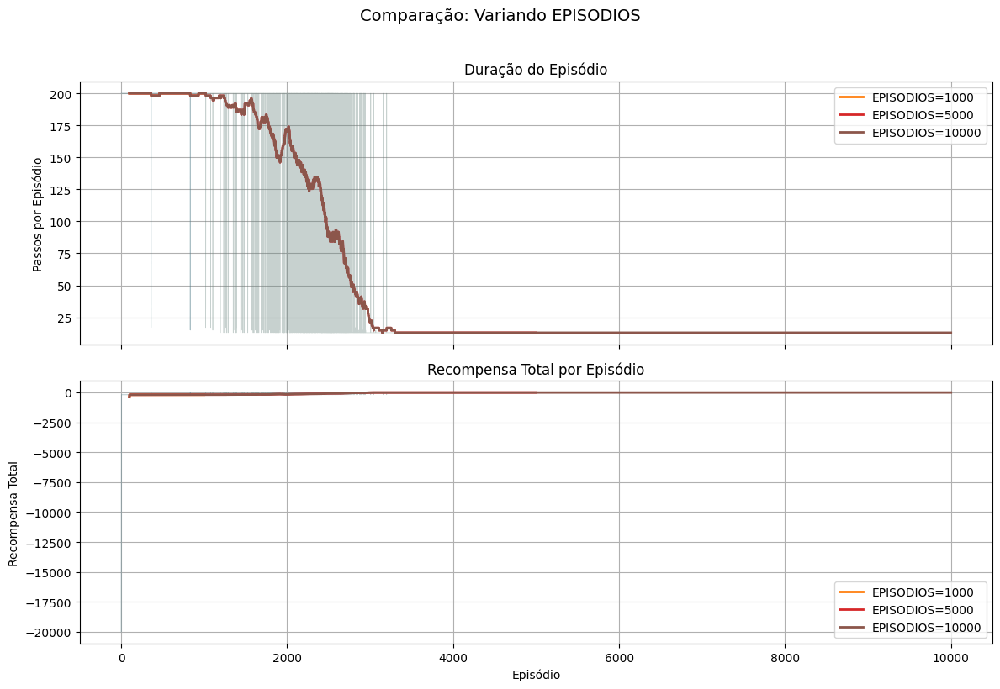
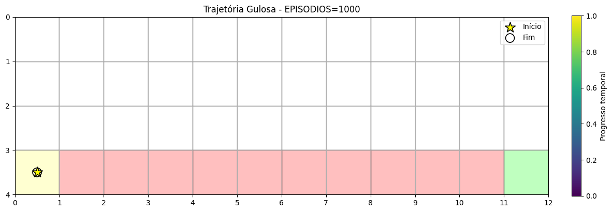
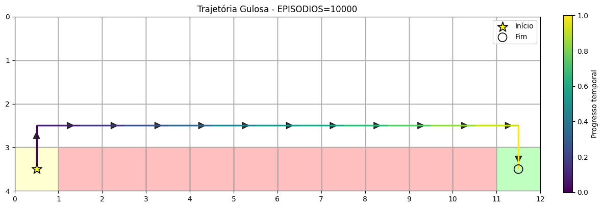
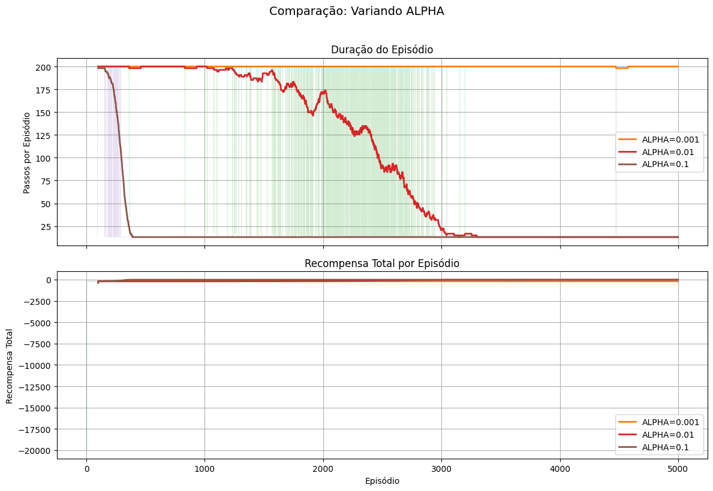
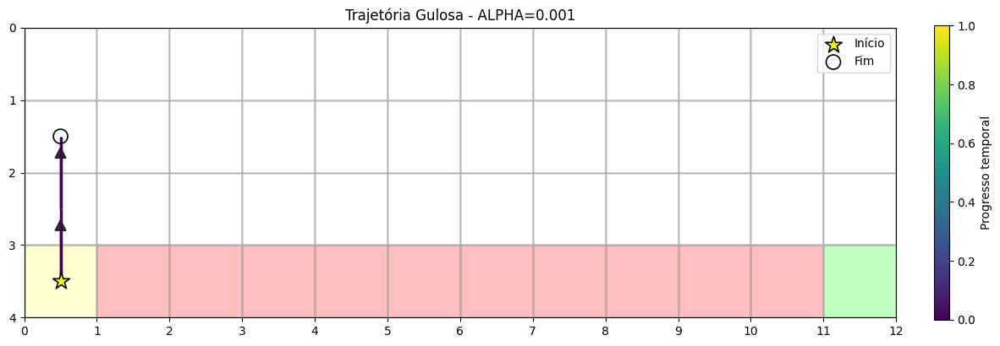
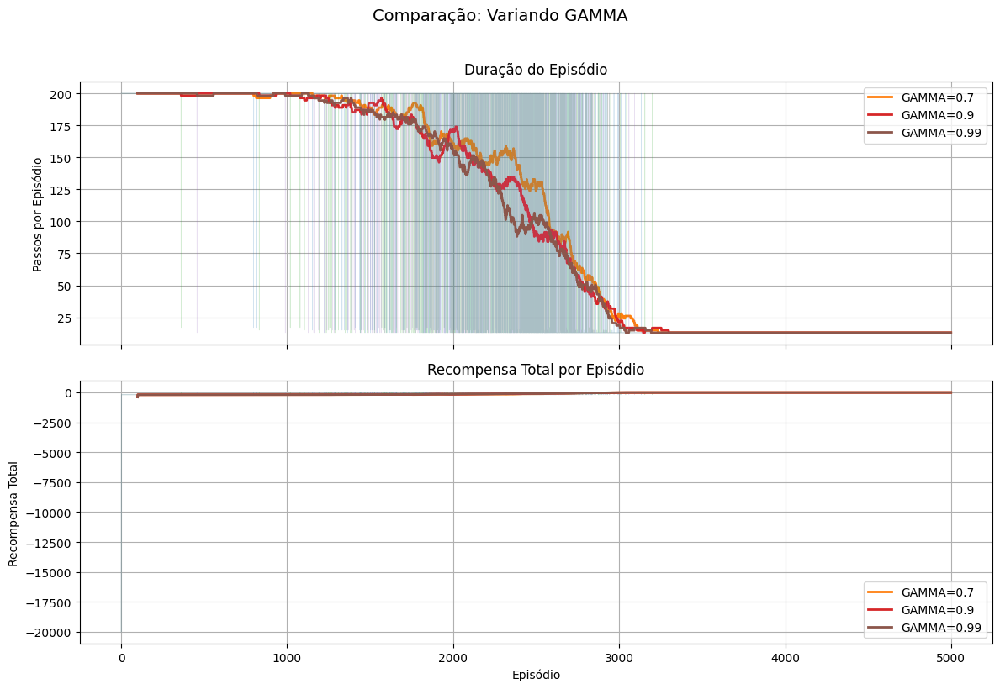
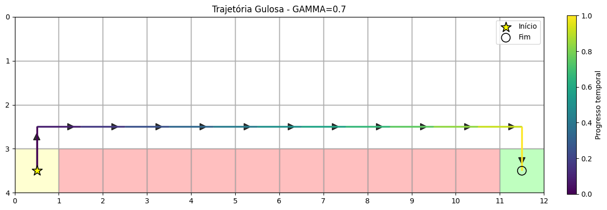
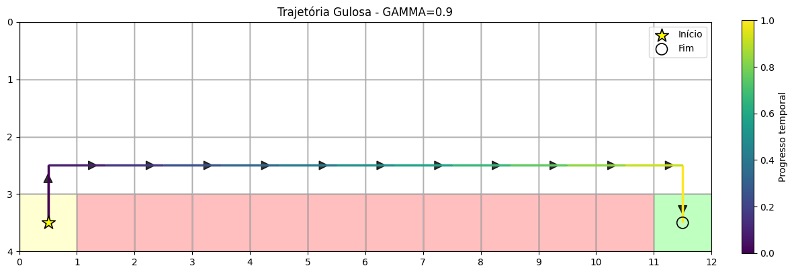
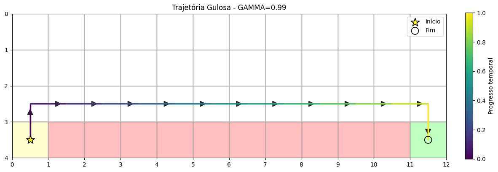
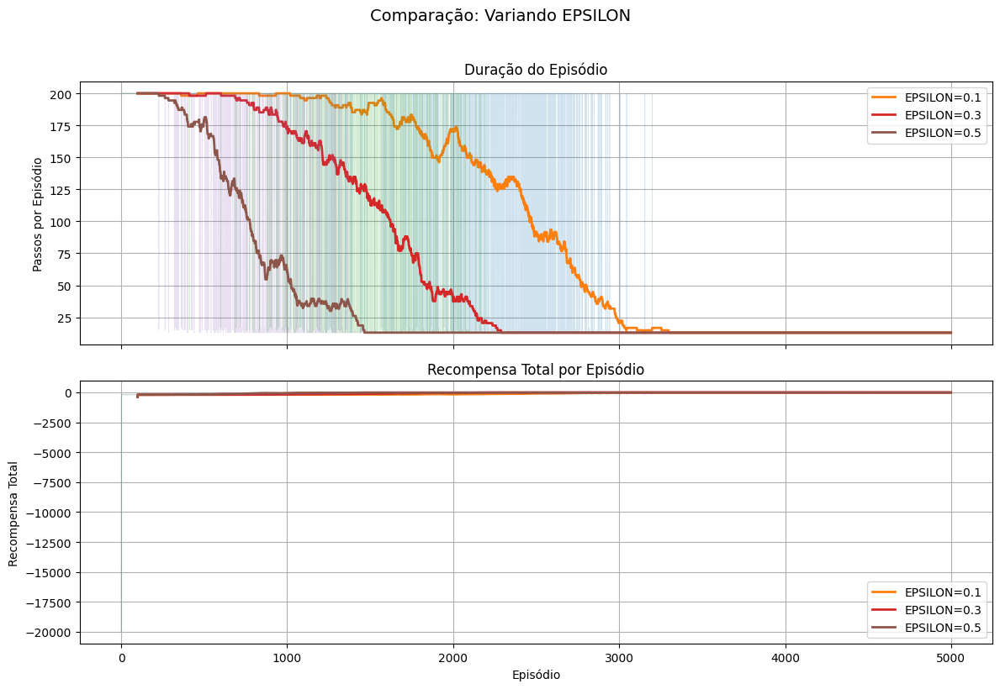

# Laboratório 8B: Q-learning (CliffWalking) - Resultados

## 1. Setup (Parâmetros Usados)

### Hiperparâmetros Base
- **EPISODIOS**: 5000
- **ALPHA**: 0.01
- **GAMMA**: 0.9
- **EPSILON**: 0.1
- **SEED**: 42

### Valores Testados para Cada Hiperparâmetro
- **EPISODIOS**: [1000, 5000, 10000]
- **ALPHA**: [0.001, 0.01, 0.1]
- **GAMMA**: [0.7, 0.9, 0.99]
- **EPSILON**: [0.1, 0.3, 0.5]

---

## 2. Resultados

### 2.1 Experimento: Variando EPISODIOS

#### 2.1.1 Métricas de Desempenho

**Análise:**
Mais episódios melhoram a convergência. Com 1000 episódios, o aprendizado é incompleto. Com 5000 e 10000, a duração do episódio estabiliza e a recompensa converge para valores próximos.

#### 2.1.2 Trajetórias Gulosas

**EPISODIOS=1000:**

**EPISODIOS=5000:**

**EPISODIOS=10000:**

**Análise das Trajetórias:**
Com 1000 episódios, a trajetória pode passar pelo penhasco. Com mais episódios, a política aprende a evitar o penhasco e seguir o caminho seguro.

---

### 2.2 Experimento: Variando ALPHA

#### 2.2.1 Métricas de Desempenho

**Análise:**
ALPHA=0.001 converge lentamente. ALPHA=0.01 apresenta bom equilíbrio. ALPHA=0.1 pode ser instável, mas converge mais rápido.

#### 2.2.2 Trajetórias Gulosas

**ALPHA=0.001:**

**ALPHA=0.01:**

**ALPHA=0.1:**

**Análise das Trajetórias:**
ALPHA baixo (0.001) pode não aprender a política ótima. ALPHA=0.01 e 0.1 aprendem a evitar o penhasco, com 0.1 podendo ser mais direto.

---

### 2.3 Experimento: Variando GAMMA

#### 2.3.1 Métricas de Desempenho

**Análise:**
GAMMA baixo (0.7) foca em recompensas imediatas. GAMMA=0.9 equilibra curto e longo prazo. GAMMA=0.99 valoriza mais recompensas futuras, mas pode convergir mais devagar.

#### 2.3.2 Trajetórias Gulosas

**GAMMA=0.7:**

**GAMMA=0.9:**

**GAMMA=0.99:**

**Análise das Trajetórias:**
Todos os valores de GAMMA aprendem a evitar o penhasco. GAMMA=0.9 tende a produzir trajetórias mais consistentes.

---

### 2.4 Experimento: Variando EPSILON

#### 2.4.1 Métricas de Desempenho

**Análise:**
EPSILON baixo (0.1) explora menos, convergindo mais rápido mas podendo ficar em subótimo. EPSILON alto (0.5) explora mais, aprendendo melhor mas com mais variância.

#### 2.4.2 Trajetórias Gulosas

**EPSILON=0.1:**

**EPSILON=0.3:**

**EPSILON=0.5:**

**Análise das Trajetórias:**
EPSILON=0.1 tende a convergir para política mais determinística. EPSILON=0.3 e 0.5 mantêm mais exploração, aprendendo políticas mais robustas.

---

## 3. Observações Gerais

### 3.1 Resumo dos Resultados por Hiperparâmetro

**EPISODIOS:**
Mais episódios melhoram a convergência. 5000 episódios são suficientes para aprender política ótima no CliffWalking.

**ALPHA:**
Taxa de aprendizado intermediária (0.01) oferece melhor equilíbrio entre velocidade e estabilidade.

**GAMMA:**
GAMMA=0.9 é adequado para CliffWalking, balanceando recompensas imediatas e futuras.

**EPSILON:**
EPSILON=0.1 é suficiente para exploração no Q-learning, que é off-policy e mais tolerante a exploração limitada.

---

## 4. Comparação com SARSA

### 4.1 Diferenças Observadas

**Comportamento:** Q-learning aprende política ótima (off-policy), enquanto SARSA aprende política segura (on-policy).

**Convergência:** Q-learning converge mais rápido para política ótima. SARSA pode convergir mais devagar mas é mais seguro durante aprendizado.

**Políticas finais:** Q-learning aprende caminho mais curto (próximo ao penhasco). SARSA aprende caminho mais seguro (afastado do penhasco).

**Robustez:** Q-learning é menos sensível a EPSILON alto. SARSA requer mais exploração (EPSILON=0.3) para aprender efetivamente.

### 4.2 Vantagens e Desvantagens

**Q-learning:**
Vantagens: Aprende política ótima, convergência mais rápida, menos sensível a exploração.
Desvantagens: Pode ser perigoso em ambientes com penalidades altas durante aprendizado.

**SARSA:**
Vantagens: Mais seguro durante aprendizado, aprende política robusta, melhor para ambientes perigosos.
Desvantagens: Pode convergir para subótimo, requer mais exploração, convergência mais lenta.

---

## 5. Conclusões

**Melhor configuração:** EPISODIOS=5000, ALPHA=0.01, GAMMA=0.9, EPSILON=0.1 oferece bom equilíbrio entre convergência e desempenho.

**Impacto dos hiperparâmetros:** EPISODIOS e ALPHA têm maior impacto na convergência. GAMMA e EPSILON afetam a política aprendida.

**Diferenças principais:** Q-learning aprende política ótima (caminho curto), SARSA aprende política segura (caminho longo). Q-learning é off-policy, SARSA é on-policy.

**Recomendações:** Use Q-learning quando segurança durante aprendizado não é crítica e política ótima é desejada. Use SARSA em ambientes perigosos ou quando segurança é prioridade.
