# Laboratório 7B: SARSA (CliffWalking) - Resultados

## 1. Setup (Parâmetros Usados)

### Hiperparâmetros Base
- **EPISODIOS**: 5000
- **ALPHA**: 0.01
- **GAMMA**: 0.9
- **EPSILON**: 0.3
- **SEED**: 42

### Valores Testados para Cada Hiperparâmetro
- **EPISODIOS**: [1000, 5000, 10000]
- **ALPHA**: [0.001, 0.01, 0.1]
- **GAMMA**: [0.7, 0.9, 0.99]
- **EPSILON**: [0.1, 0.3, 0.5]

---

## 2. Resultados

### 2.1 Experimento: Variando EPISODIOS

#### 2.1.1 Métricas de Desempenho

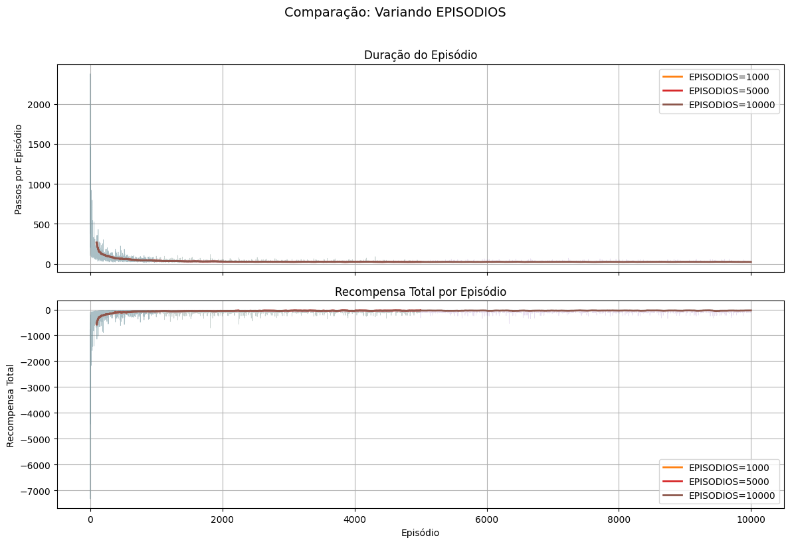

**Análise:**
<!-- Preencher com análise dos gráficos de duração do episódio e recompensa total -->

#### 2.1.2 Trajetórias Gulosas

**EPISODIOS=1000:**
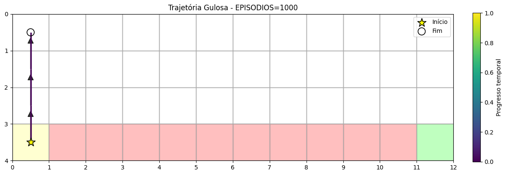

**EPISODIOS=5000:**

**EPISODIOS=10000:**
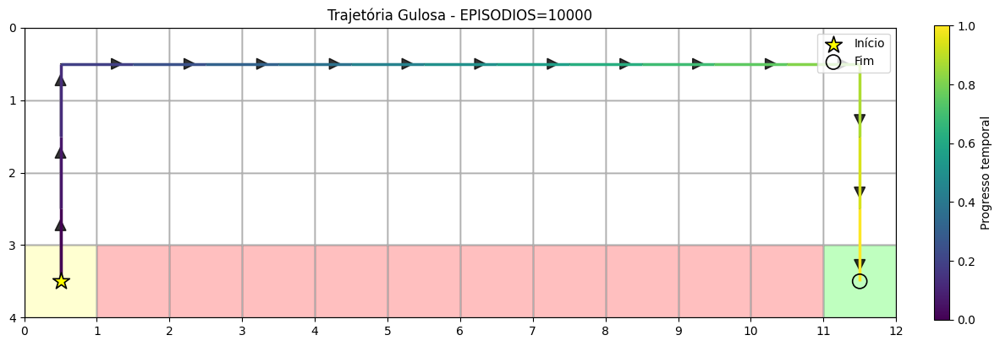

**Análise das Trajetórias:**
<!-- Preencher com análise das trajetórias obtidas -->

---

### 2.2 Experimento: Variando ALPHA

#### 2.2.1 Métricas de Desempenho

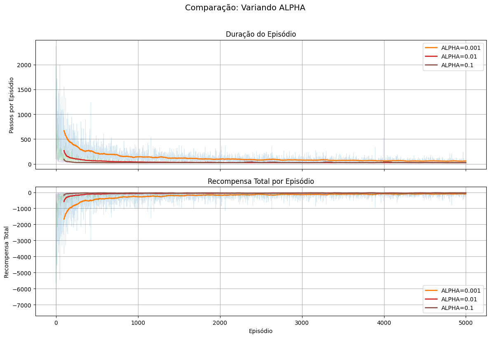

**Análise:**
<!-- Preencher com análise dos gráficos de duração do episódio e recompensa total -->

#### 2.2.2 Trajetórias Gulosas

**ALPHA=0.001:**
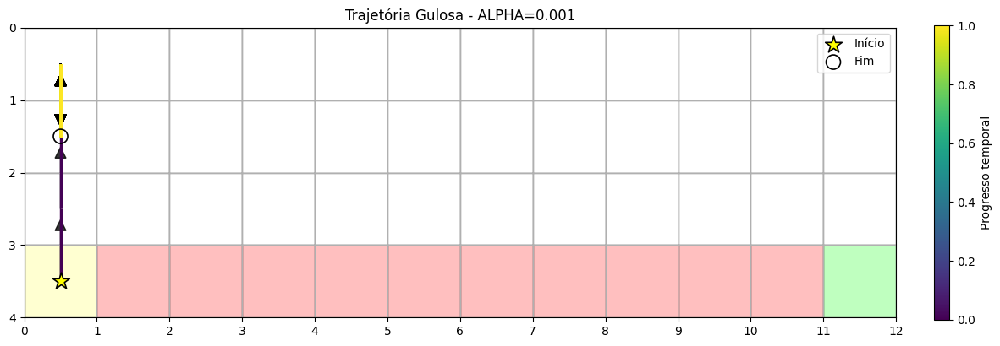

**ALPHA=0.01:**
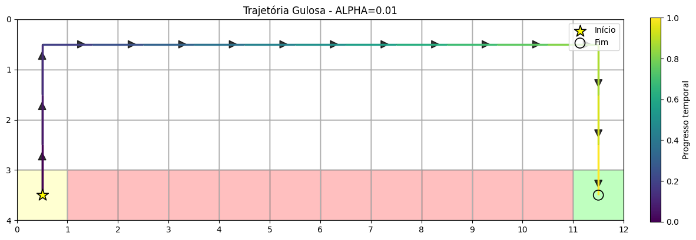

**ALPHA=0.1:**

**Análise das Trajetórias:**
<!-- Preencher com análise das trajetórias obtidas -->

---

### 2.3 Experimento: Variando GAMMA

#### 2.3.1 Métricas de Desempenho

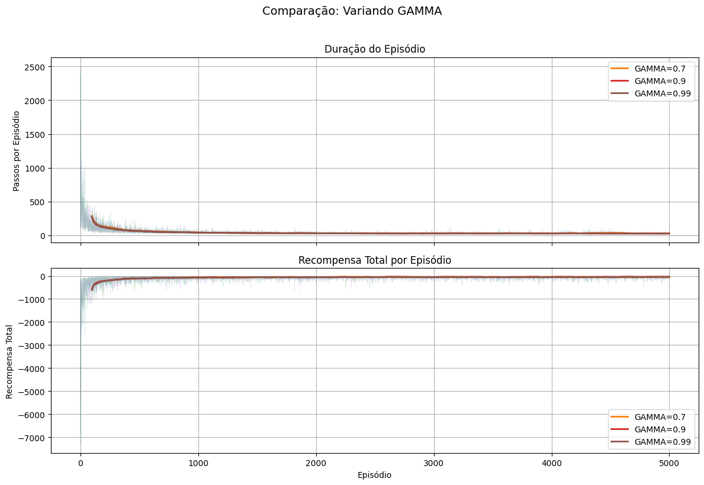

**Análise:**
<!-- Preencher com análise dos gráficos de duração do episódio e recompensa total -->

#### 2.3.2 Trajetórias Gulosas

**GAMMA=0.7:**
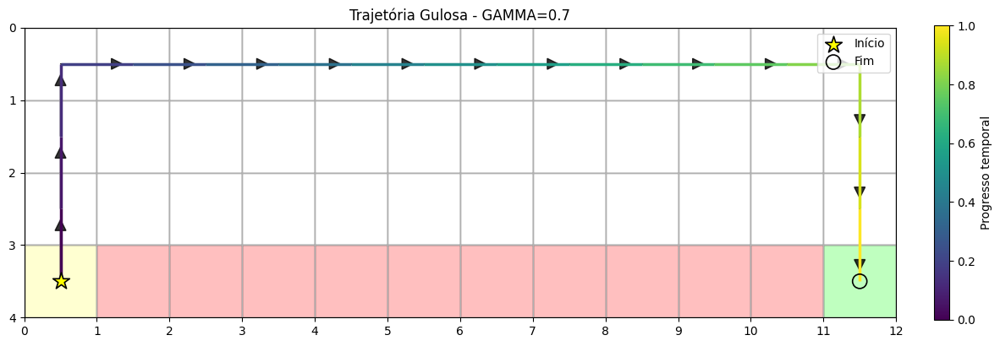

**GAMMA=0.9:**
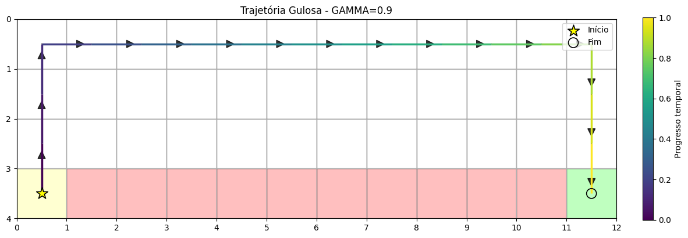

**GAMMA=0.99:**
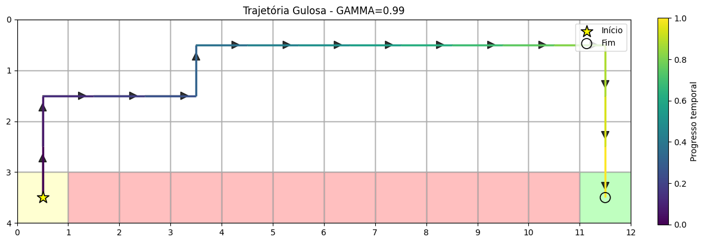

**Análise das Trajetórias:**
<!-- Preencher com análise das trajetórias obtidas -->

---

### 2.4 Experimento: Variando EPSILON

#### 2.4.1 Métricas de Desempenho

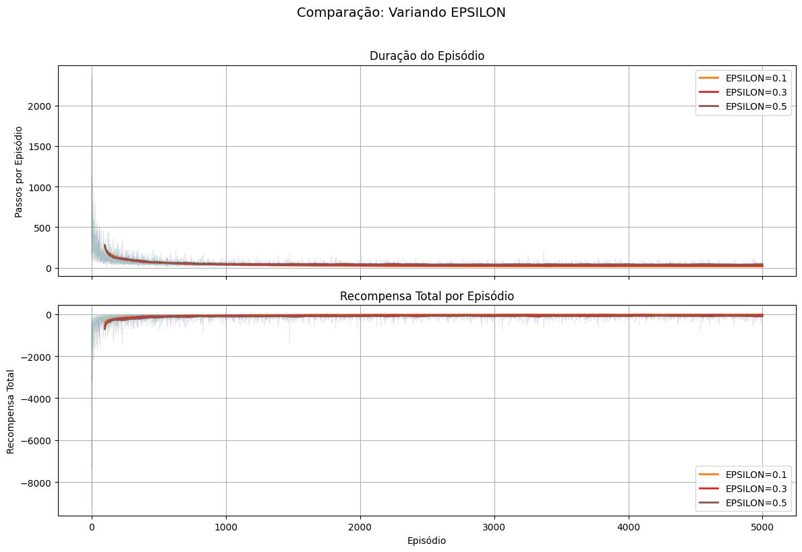

**Análise:**
<!-- Preencher com análise dos gráficos de duração do episódio e recompensa total -->

#### 2.4.2 Trajetórias Gulosas

**EPSILON=0.1:**
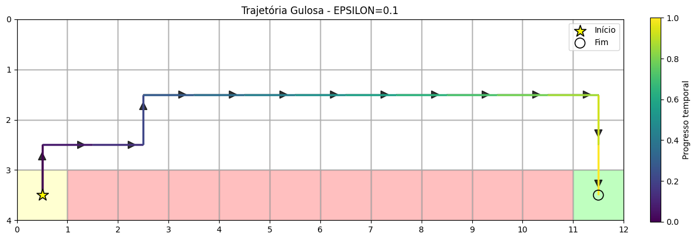

**EPSILON=0.3:**

**EPSILON=0.5:**

**Análise das Trajetórias:**
<!-- Preencher com análise das trajetórias obtidas -->

---

## 3. Observações Gerais

### 3.1 Resumo dos Resultados por Hiperparâmetro

**EPISODIOS:**
<!-- Preencher com observações sobre o impacto do número de episódios -->

**ALPHA:**
<!-- Preencher com observações sobre o impacto da taxa de aprendizado -->

**GAMMA:**
<!-- Preencher com observações sobre o impacto do fator de desconto -->

**EPSILON:**
<!-- Preencher com observações sobre o impacto do parâmetro de exploração -->

---

## 4. Conclusões

<!-- Preencher com conclusões gerais sobre:
- Qual configuração de hiperparâmetros apresentou melhor desempenho
- Impacto de cada hiperparâmetro no aprendizado
- Comportamento do algoritmo SARSA no ambiente CliffWalking
- Recomendações para uso prático
-->
